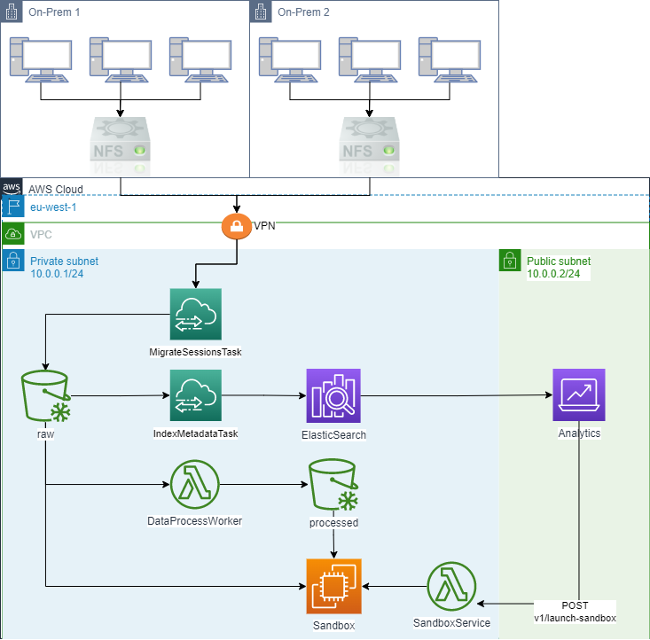

# Personal Notes

I hope this is not too much / too little. I tried to be concise but still stay close to reality and address the core challenges. I tried to thoroughly explain my mindset for each decision and I hope it did not get over-verbose.

There are many approaches one can take for such system, from full on-prem and much code, heavy open source usage up to full cloud solution. I went with a cloud solution and a strong emphasize on cost minimizations - Since S3 and EC2 were part of the boundary conditions, AWS seemed a proper choice.

The PDF is generated from plain text and all of the assets are open and part of the repository. 

# Overview

Each day, 10 ```Sessions``` occur, producing ```Session Data``` files and a single ```Session Metadata``` file.

The ```Session Data``` files are stored in a binary format while the ```Session Metadata``` file is a plain text file. Overall, the files utilize approximately 600MB of memory on disk.

## Assumptions

In this section I describe my own assumptions. In a real world scenario those should be understood and acquired through domain knowledge, research and prioritization 

1. ```Sessions``` are running on multiple, on-prem machines.

1. **Security, privacy and durability** are important. We deal with company's IP and wouldn't want it leaked.

1. We don't have additional information regarding the structure of the binary data files. Potentially, we could store them as well in designated databases (as well as the raw data in S3). For example, if we knew it contain sensor acquired data, we could utilize a storage engine suited for time series such as [InfluxDB](https://www.influxdata.com/).

1. ```Session Metadata``` is a collection of Key-Value pairs 

## Requirements

__Functional__

1. Migrate ```Session Data and Metadata``` to S3 buckets

1. Each ```Session Data``` should be processed **once** upon upload and be stored invidividually as ```Session Post-Processed Data```

1. Migrate ```Session Metadata``` to a storage engine with ad-hoc, low latency querying capabilities providing traceback to the correlated ```Session Data and Post-Processed Data```

1. Provide a capability to ramp an EC2 instance by demand and automatically bootrstap access to all related data of a specific ```Session```, namely the ```Session Data, Metadata and Post-Processed Data```

__Non Functional__

1. Data movement between on-prem to cloud should be private

1. Data should be kept indefinitely, as cheap as possible

1. System should be decoupled to enable future extensions and alterations. Every component should ideally be replaceable without affecting the rest of the components

1. System should provide observability mechanisms

# System Components

In this section we will identify the components in the system, describe their characterisitcs, choose an implementation and explain the reasonings.

## Sources

**Sources** are the machines where we store ```Sessions``` information upon.

We should have complete control over the processes running on those machines.

> Note that those machines are not necessarily the machines executing the experiments producing the data (Although they might be). The can be NFS/SMB/NetApp addressible from machines running the sessions. For example, in a laboratory containing multiple hardwares producing data, we can connect each to a Nuc/Rpi and use a laboratory central NFS server to store the generated data on. 

## Event Bus (Aws SNS)

Components in the system needs to communicate with each other. Rather than directly communicating between, the event based approach is an asynchronous and un-persisted form of communication. It enable decoupling components from each other and great extensibility.

As we will see, we will capitalize Aws services as the implementation for the components, hence [Aws SNS](https://aws.amazon.com/sns/?whats-new-cards.sort-by=item.additionalFields.postDateTime&whats-new-cards.sort-order=desc) is a natural fit for our bus, we will use it as our main communication middleware.

It provides us with

1. Observability through [Aws CloudWatch](https://aws.amazon.com/cloudwatch/)
1. Seemless integration with all other Aws services

## Blob Storage (Aws S3)

The **Blob Storage** is the storage layer we use to store ```Session Data, Metadata and Post-Processed Data```.

Notice that we store the ```Session Metadata``` here as well. A reasoning for this is we want to have this storage layer as our source of truth. Later, we will copy the metadata to a different engine with features to answer the requirements related to the ```Session Metadata```. 

### Characteristics

**Schemaless**

The ```Session Data``` and ```Session Post-Processed Data``` doesn't have a known/consistent schema (See assumptions, this could be handled differently on different systems).

**Highly Durable**

```Session```s information should be stored indefinitely and data loss not acceptable.

**Mostly available**

The ```Session Data``` and ```Session Post-Processed Data``` is accessed by demand and involves a relatively long setup. It is not used for Ad-Hoc analytics, Doesn't have any updates and a couple of seconds extra will not affect any required workload.

### Implementation Details

It is part of the requirement to utilize S3 as the technology so we will use it. Generally there can be alternatives such as Hdfs, Minio, Azure Blob Storage etc...

Minio and Hdfs are good candidates for on-prem solutions.

**Data Layout**

Firstly, we will have a single bucket named ```Sessions``` (realistically it should be an S3 unique name, so we will need a more specific name)

In our system, each ```Session``` has a ```SessionId```. We will map each session to a folder inside the bucket using this id.

Inside a session's folder we will create two sub-folders, one for the ```Session Data``` which we will name ```raw``` and another for ```Session Post-Processed Data``` which we will name ```processed```.

To illustrate, the sessions bucket might look like

- id-of-session-1
  - raw
    - sensor-a.bin
    - faults.log
- id-of-session-2
  - raw
    - sensor-a.bin
    - sensor-b.bin
  - processed
    - statistics.csv

We can access a file using the url

    s3://sessions/id-of-session-1/processed/statistics.csv

> I can't really recall how S3 manages sub folders, still it's a minor and technical detail. We can use a naming scheme to model such hierarchy

**Storage Class and Lifecycle Policy**

By default we will use the [S3 Glacier Instant Retrieval](https://aws.amazon.com/s3/storage-classes/#Instant_Retrieval) storage class. This is a very cheap tier that still provides us with the needed requirements.

In addition we will define a lifecycle policy to move 1yr old files to the [S3 Glacier Deep Archive](https://aws.amazon.com/s3/storage-classes/#Instant_Retrieval) storage class.

**Users**

We will create users for the different services in the systems to control the access

> In practice we will create appropriate roles and attach those to the users. For each user, I specified the required permissions the role should support

- MigrationService - WriteOnly
- Research - ReadOnly. Specifically, we need to get all files using the ```SessionId```

**Triggers**

Initially I was tempted to use S3's trigger mechanisms to support the movement of the ```Session Metadata``` to the search engine, or to process the ```Session Data```, but it leads to technical neuances. A better approach is to capitalize the migration service we use to also suport those functionalites.

Therefore, we will not use any trigger in S3.

## Metadata Storage (OpenSearch)

The **Metadata Storage** is the storage component holding the ```Sessions Metadata``` which provide search capabilities. 

### Characteristics

**Key Value Model**

The ```Session Metadata``` is composed as a collection of Key-Value pairs.

**Highly available**

The usecase for querying the metadata is to look for relevant sessions. This is probably made by investigating the data online. In such scenario, high latency is un-welcomed and immediate feedback is required.

**Ad-Hoc Query capabilities**

For data investigation we need to provide Ad-Hoc capabilities rather than a fixed set of queries. The metadata is dynamic and handling all of the cases is unrealistic in the long-term.

### Implementation Details

[ElasticSearch](https://www.elastic.co/elasticsearch/) is a natural candidate.

- It provides fast search gaurantees
- It has a great self service platform (Kibana) and many mature integrations
- It supports fuzzy search and match scores which sounds great for the use case

[Aws OpenSearch](https://aws.amazon.com/opensearch-service/) is a managed ElasticSearch service.

Using Kibana, we can provide custom dashboards and filters to the users to investigate existing sessions.

In addition we will add custom UI component to initiate the ramp up of a new sandbox environment using the filtered results.

## Migration Service (Aws DataSync)

**Migration Service** is a process to continuously

1. Migrate new data produced at the **Sources** into the **Blob Storage**
1. Copy ```Session Metadata``` from the **Blob Storage** to the **Metadata Storage**.

This service should have access to the **Sources** and to the **Blob/Metadata Storage** components.

### Characteristics

**Configurable Schedule**

**Externalized Logs, Traces and Metrics**

This service is a continously running service. To inspect the process we should have access to logs traces and metrics.

It is not mandatory but this service can be distributed making the observability requirements much more important. 

### Implementation Details

Some alternatives are

- [Apache Nifi](https://nifi.apache.org/) is a great low-code data migration solution
- [Node Red](https://nodered.org/) can also be utilized for data migration
- [Apache Airflow](https://airflow.apache.org/) is a programmable pipeline platform that can be utilized for data migrations in a programmatic way
- [Kafka](https://kafka.apache.org/) by utilizing the Connect API.

Still, I think [Aws DataSync](https://aws.amazon.com/datasync/) is a better fit. The reasoning is

- As an AWS managed service it has the best integration with other AWS services
- As a managed service we have less to worry about withr respect to infrastructure
- It integrates seemlesly with [Aws CloudWatch](https://aws.amazon.com/cloudwatch/) providing us with good observaility while other solutions require us to tailor a solution of our own

We will configure the following Tasks

Task | Description |
-----|-------------|
MigrateSessionsTask | Migrate all of a ```Session```'s files from the ```Sources``` onto the **Blob Storage**. AWS DataSync Agents are needed to be deployed on the sources |
IndexMetadataTask | Copy the ```Session Metadata``` from **Blob Storage** to **Metadata Storage**

The service will notify the **Event Bus** with the following Events

Event | Payload | Trigger |
------|---------|-------------|
SessionMigratedEvent | SessionId | ```MigrateSessionsTask``` has finished

## Data Processing Service (Aws Lambda)

A service that process ```Session Data``` and upload the results back to the **Blob Storage**.

### Characteristics

**Run Arbitrary code**

### Implementation Details

[Aws Lambda](https://aws.amazon.com/lambda/) is a great choice
- The charges are per invokation, in our system we don't have much. I believe that this specific workload is still in the free-tier bounds 
- It integrates seemlesly with our chosen migration service
- It abstracts the infrastructure
- It can run in a private subnet within our VPC completely removing security threats
- Since it is running on top of the AWS backbone, Latency to S3 is as low as can possibly be

The lambda is invoked by listening on the ```SessionMigratedEvent``` event and extracts the ```SessionId``` from the event's payload.

## Sandbox Service (Aws Lambda)

A service the provides the mechanisms to ramp an EC2 instance containing the relevant ```Session``` files.

### Implementation Details

[Aws Lambda](https://aws.amazon.com/lambda/) is again a great choice. We have a simple logic which is mostly composed of contacting Aws's ec2 API (through the cli) and registering a predefined startup script.

We will implement a function that will receieve a list of ```SessionId```s and a list ```Callback Addresses```es (Phone number, Email address etc...) which will prepare the environment.

We will have the following events notified to the **Event Bus**

Event | Payload | Trigger |
------|---------|-------------|
SandboxEnvironmentReadyEvent | SessionIds, CallbackAddresses | EC2 instance is ready

Further details on the machine and the sandbox environment are discussed later as it is off topic from this service. This service only in charge of getting the request and initiate a rampup with the relevant parameters.

# The Sandbox Environment

This is the environment on newly created EC2s, containing all of the data for multiple ```Session```s.

We will create an [AMI](https://docs.aws.amazon.com/AWSEC2/latest/UserGuide/AMIs.html) ahead of time that contains the desired OS and the tooling we want preinstalled.

A stratup script will be defined to capture the ```SessionIds``` from the environment, and for each id, copy the entire folder from the **BlobStorage** onto local storage. 

The storage type we will use is the **Instance Storage**. Although extremely volatile, I don't see any reason not to use it - It provides the best performance with no extra charges.

With regards to the EC2 instance type - We can consider provided a hardware accelerated instance such that frameworks can capitalize upon. It is highly dependant to the workloads expected to be performed from within the sandboxes.

The relevant events should be triggered as part of the bootstraping script.

# Diagram

Architecture diagram for a single region, single AZ illustrating the above

